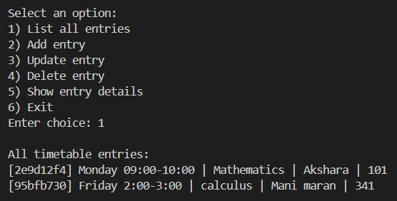
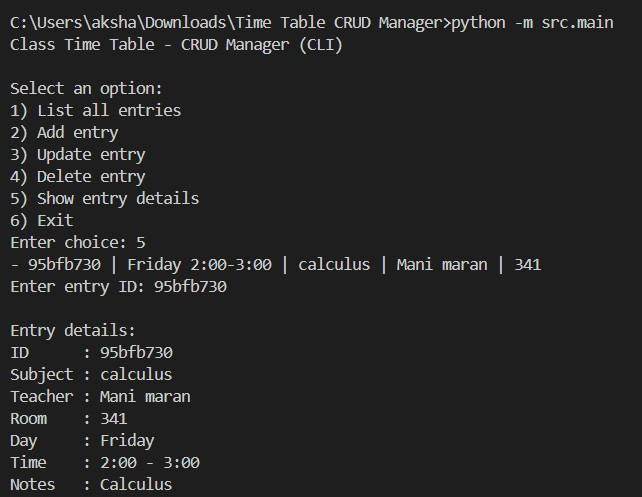
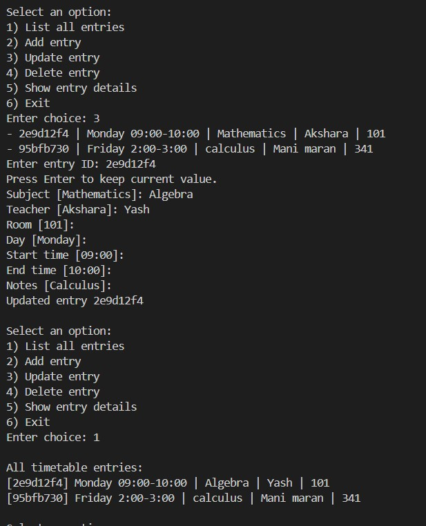
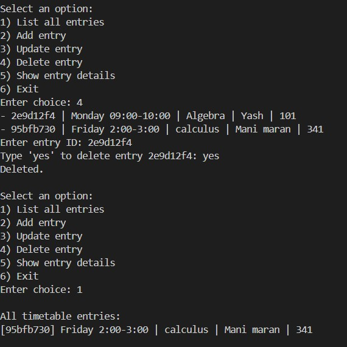
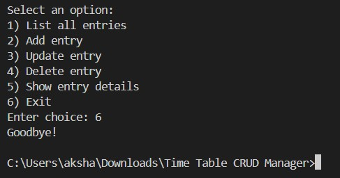

# Time Table CRUD Manager
## Overview

The Time Table CRUD Manager is a beginner-friendly Python application designed to manage academic class schedules. It allows users to create, read, update, and delete timetable entries using simple command-line interactions. The project uses object-oriented programming and stores data using JSON instead of a traditional database.

## Features

• Add class entries with subject, teacher, room, day, time, and notes
• List all timetable entries
• Update existing entries
• Delete unwanted entries
• View detailed information of any entry
• Prevents time conflicts for the same teacher or room
• Data persistence using a JSON file
• Clean modular structure (OOP-based)

## Technologies / Tools Used

• Python 3.8+
• Object-Oriented Programming
• JSON for data storage
• Standard Python libraries only (no external dependencies)
• Git & GitHub for version control
• Command-line interface (CLI)

## Steps to Install & Run the Project

1. Download or clone the repository using:
   git clone [https://github.com/Akshara09-8/Time-Table-CRUD-Manager.git](https://github.com/Akshara09-8/Time-Table-CRUD-Manager.git)

2. Navigate to the project folder in your terminal:
   cd Time-Table-CRUD-Manager

3. (Optional but recommended) Create a virtual environment:
   python -m venv venv
   Activate it:
   • Windows: venv\Scripts\activate
   • Mac/Linux: source venv/bin/activate

4. Install requirements (none needed, but run the command):
   pip install -r requirements.txt

5. Run the application:
   python -m src.main

## Instructions for Testing

Follow this input flow to test the entire CRUD process:

1. Add a new entry
   Example input:
   Subject: Mathematics
   Teacher: Alice
   Room: 101
   Day: Monday
   Start time: 09:00
   End time: 10:00
   Notes: Algebra basics

2. Add another entry:
   Subject: Physics
   Teacher: Bob
   Room: 102
   Day: Monday
   Start time: 10:00
   End time: 11:00

3. Try adding a conflicting entry to test error handling:
   Teacher: Alice
   Room: 101
   Day: Monday
   Start time: 09:30
   End time: 10:30
   (Should show conflict error)

4. List all entries (Option 1)

5. Show entry details (Option 5)

6. Update an entry (Option 3)

7. Delete an entry (Option 4)

8. Exit the program (Option 6)

## Screenshots

---

